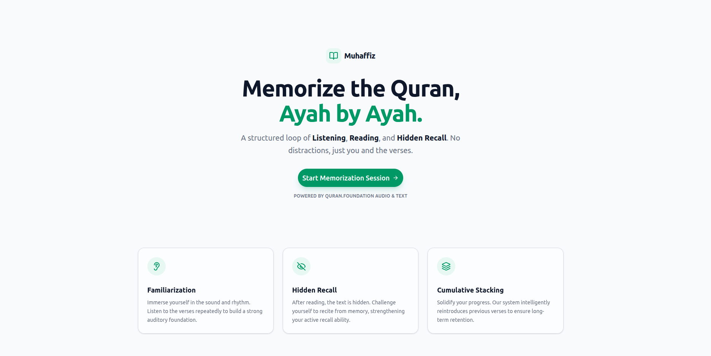
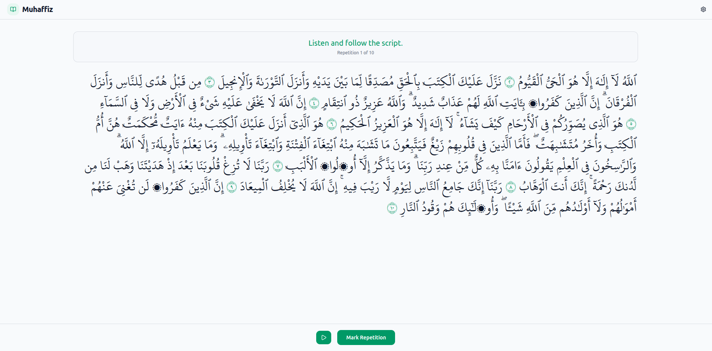
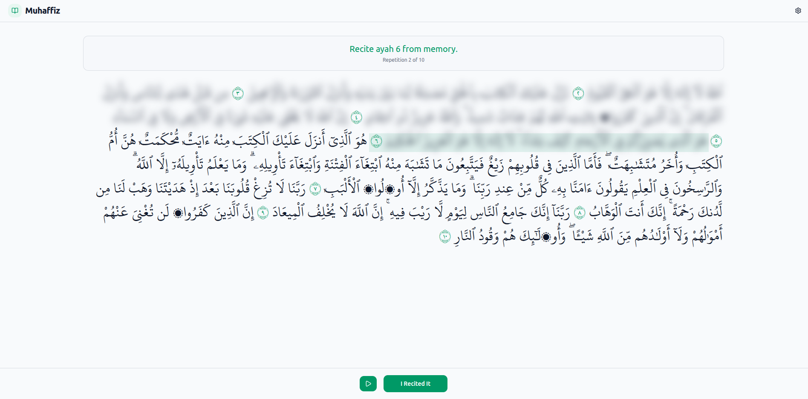
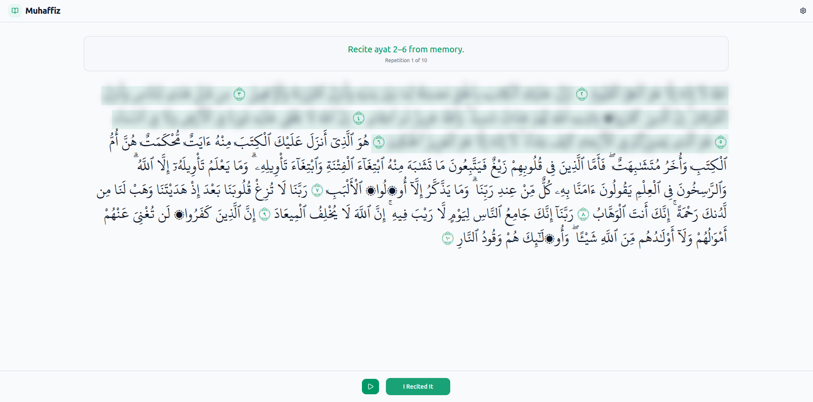

# Muhaffiz (محفّظ)

**A Structured Quran Memorization System**

   

## 📖 Overview

**Muhaffiz** is a specialized web application designed to help in Quran memorization. Unlike standard reading apps, it guides users through a structured active-recall workflow:

1. **Familiarization:** Listen and repeat individual Ayahs.
2. **Memorization:** Cumulative recall (e.g., recite Ayah 1, then 1-2, then 1-3) with hidden text.
3. **Review:** Seamless audio looping based on precise timestamp segments.

Built with **Next.js 16**, this project emphasizes **sustainability** and **performance**, utilizing aggressive server-side caching to minimize API usage and carbon footprint.

## 📷 Screen shots

- 
- 
- 
- 

## 🚀 Live Demo

Visit the live application: [https://muhaffiz.vercel.app/](https://muhaffiz.vercel.app/)

## ✨ Key Features

- **🧠 Guided Memorization Flow:** A state-machine driven interface that transitions users from listening to reciting.
- **🔄 Cumulative Recall Logic:** Automatically enforces linking verses together to strengthen long-term retention.
- **🎧 Precision Audio Looping:** Custom audio engine that plays specific Ayah ranges (e.g., Ayah 3-5) using dynamic timestamp slicing—no server-side audio processing required.
- **⚡ Sustainable Architecture:** Uses Next.js `unstable_cache` with indefinite revalidation to ensure zero external API calls for repeated sessions.
- **🎨 Modern UI:** A responsive, accessible interface built with **shadcn/ui** and **Tailwind CSS**.

## 🛠️ Tech Stack

- **Framework:** Next.js 16
- **Language:** TypeScript
- **Styling:** Tailwind CSS
- **UI Components:** shadcn/ui (Radix Primitives)
- **Icons:** Lucide React
- **Data Fetching:** Native `fetch` + `unstable_cache`
- **API Integration:**
  - `@quranjs/api` (Official SDK)
  - Custom `LocalQuranApiClient` (OAuth 2.0 implementation)

## 🚀 Getting Started

### Prerequisites

- Node.js 18+ installed
- npm or pnpm

### Installation

1. **Clone the repository:**

   ```bash
   git clone git@github.com:adel-gu/muhaffiz.git
   cd muhaffiz
   ```

2. **Install dependencies:**

   ```bash
   npm install
   # or
   pnpm install
   ```

3. **Configure Environment Variables:**
   Create a `.env.local` file in the root directory and add your Quran.Foundation API credentials:

   ```env
   # Quran.Foundation API Credentials
   QURAN_CLIENT_ID=your_client_id_here
   QURAN_CLIENT_SECRET=your_client_secret_here
   QURAN_AUTH_URL=https://auth.quran.com/api/v1/token
   QURAN_API_BASE_URL=https://api.quran.com/api/v4/internal
   ```

4. **Run the development server:**

   ```bash
   npm run dev
   ```

5. **Open the app:**
   Visit `http://localhost:3000` in your browser.

## 🏗️ Architecture & Design Decisions

### 1. Direct Data Access (RSC)

Instead of creating internal API routes (e.g., `/api/verses`), this app fetches data directly inside **React Server Components**. This reduces network latency, eliminates serialization overhead, and keeps the client bundle small.

### 2. Sustainability via Caching

To align with Quran.Foundation's sustainability goals, this app treats Quranic text and Reciter lists as **static assets**.

- **Strategy:** `unstable_cache` with `revalidate: false`.
- **Impact:** Once a Surah is fetched, it is cached on the filesystem. Subsequent requests trigger **zero** external API calls.

### 3. Custom Audio Client

The official SDK did not support retrieving precise word-level/segment timestamps for specific recitation IDs needed for the looping logic.

- **Solution:** I implemented `LocalQuranApiClient`, a custom TypeScript class that handles the OAuth 2.0 Client Credentials flow to securely access internal endpoints and retrieve granular timestamp data.

## 🗺️ Future Roadmap

- **🤖 AI Tutor:** Integration with ASR (Automatic Speech Recognition) to provide real-time error detection during recitation.
- **📅 Intelligent Scheduler:** Dynamic generation of Hifz schedules based on user goals and performance.
- **📊 Community Dashboard:** Social features to track progress, share milestones, and view retention heatmaps.

## 📄 License

This project is open-source and available under the [MIT License](LICENSE).
